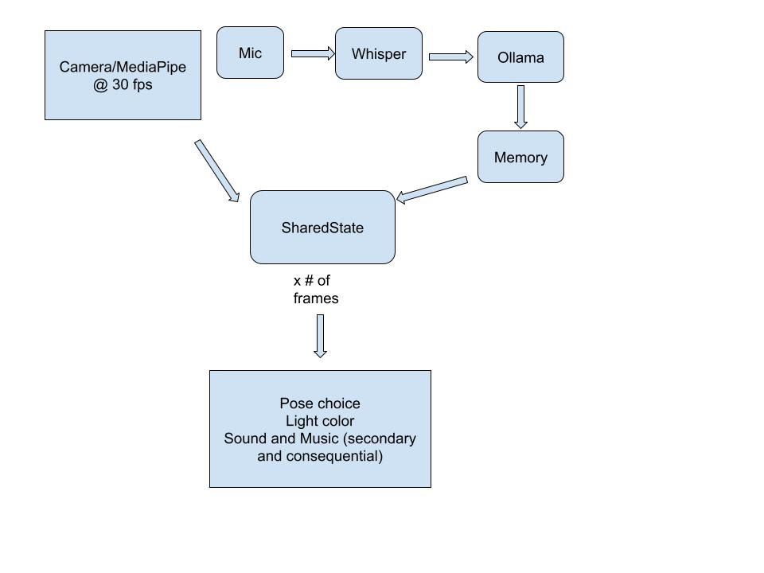

# Design Notes

## Architecture

Camera/MediaPipe (30fps) and the microphone feed two parallel paths.
Camera frames go straight into `SharedState`. Mic audio goes through
Whisper for transcription, then Ollama for the response, with the
result written to memory before it also lands in `SharedState`.
`SharedState`, updated across many frames, drives pose choice, light
color, and sound/music (secondary and consequential).

## Design Decisions

- I chose MuJoCo as the basis for manipulating the lamp stand. This is
  because the primary competing alternative, PyBullet, is quite
  unstable and unmaintained.
- `mj_step` is a function that appears to simulate real-world physics
  better than `mj_forward`. However, I chose `mj_forward` because it
  provided for a more malleable interface.
- MJSpec was the only model that allowed for visible light color
  manipulation. This allowed for mood switching.
- The microphone does not pick up anything while the lamp speaks. This
  was to eliminate the possibility of the lamp talking to itself, as
  the mic may register its own physical sound. The tradeoff is that it
  cannot be interrupted.
- This does not work in a noisier setting. 100 millisecond chunks.
- The LLM returns a mood and text given everything that has happened
  so far.

## Measurements

| Metric | Value |
|---|---|
| Whisper transcription | 437ms median (392–1165ms, n=13) |
| LLM response | 669ms median (444–914ms, n=13) |
| End-to-end | ~1.1s typical |
| Face detection rate | 96.8% |
| Detection flips | 14/min |
| CPU | 69.1% mean, 143.4% peak |
| Memory (RSS) | 1286MB mean, 1310MB peak |

Hardware: Apple M3 Pro, 36GB, macOS Tahoe 26.6.1.
Models: Whisper base, llama3.2-vision.

## Deployment

This is currently only runnable on macOS, as that is all `mjpython` is
supported on. Many functions such as `say` do not run on Ubuntu.
MuJoCo, OpenCV, Whisper, Ollama, and sounddevice all run on Ubuntu.

The product is also 1.3 GB in size, and the CPU experimentally peaks
at 143%. Face detection is on a per-camera basis, meaning it would
have to be local, but the audio and conversational piece could be
outsourced remotely. However, this would make things so that the
accuracy and transcription is at the mercy of whatever service or API
is being used.

## Physics

The limits posed by universal torque principles are completely
ignored, there is no center of mass or distribution accounted for, and
the mechanics of this model would have to be refined to account for
real hardware limitations.

## Limitations and Next Steps

Object recognition reliability and frame-capture timing, no
interruptibility, flat object memory with no retrieval by content,
hardcoded 120 BPM rather than beat tracking, pygame/cv2 SDL2 conflict,
fixed pose vocabulary with no gesture sequences.

As a jazz musician by trade, my plan was to have this lamp play
backing tracks, listen to your four bar phrases over it, and then
respond logically and as a human musician would.
